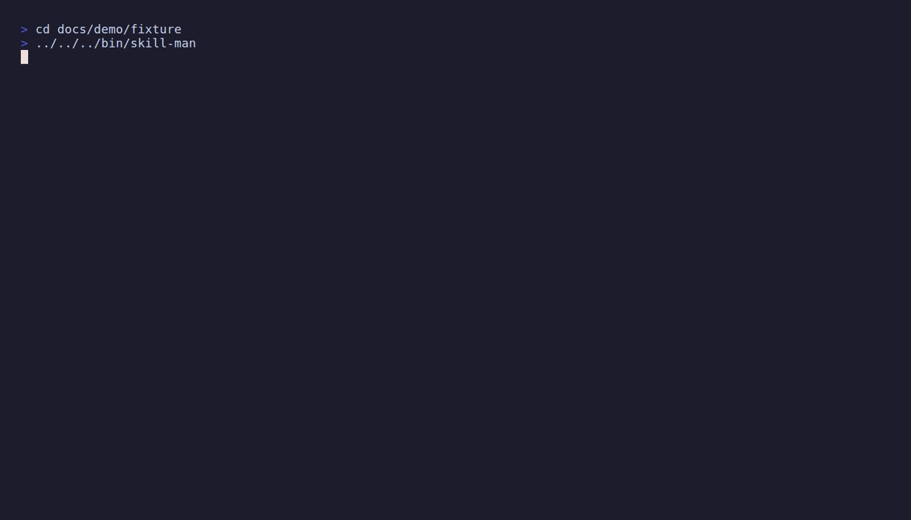

<div align="center">

```
████ █  █ ███ █    ▓      ▓   ▒  ▒▒  ▒  ▒
█    █ █   █  ▓    ▓      ▓▓ ▒▒ ▒  ▒ ▒▒ ▒
███  ██    █  ▓    ▓      ▓ ▒ ▒ ▒▒▒▒ ▒ ▒▒
   █ █ █   █  ▓    ▓      ▓   ▒ ▒  ▒ ▒  ▒
████ █  █ █▓▓ ▓▓▓▓ ▓▓▓▓   ▒   ▒ ▒  ▒ ▒  ░
```

# skill-man

**One TUI for every Agent Skill & MCP config — discover, preview, bind, ship.**

[](https://github.com/JoeHe0x/skill-man/stargazers)
[](https://go.dev/)
[](LICENSE)
[](https://github.com/charmbracelet/bubbletea)

[English](#why-skill-man) · [中文](#中文简介) · [Features](#features) · [Quick start](#quick-start) · [Keybindings](#keybindings)

**[⭐ Star on GitHub](https://github.com/JoeHe0x/skill-man)** if this saves you from juggling ten config files.



</div>

---

## Why skill-man?

Cursor, Claude Code, Codex, and Windsurf each store **Skills** and **MCP servers** in different folders and formats. You end up grepping JSON, editing TOML blind, and wondering which agent actually picked up your change.

**skill-man** is a keyboard-first terminal workbench that puts everything in one split-pane UI:

| Instead of… | Use skill-man to… |
|-------------|-------------------|
| `find` + `cat` + editor hopping | Browse, search, and preview in one screen |
| Guessing which agent sees which skill | Filter by agent and **bind** across toolchains |
| Hand-editing `mcp.json` / `config.toml` | **Toggle**, **bind**, and **remove** with confirmations |
| Fragile one-off shell scripts | **Rescan** disk and see live counts in the header |

Built with [Charm](https://charm.sh/) — [Bubble Tea](https://github.com/charmbracelet/bubbletea), [Lip Gloss](https://github.com/charmbracelet/lipgloss), [Glamour](https://github.com/charmbracelet/glamour).

---

## Features

### Skills tab

- **Scan** project & global skill dirs across **70+ agent** layout conventions
- **List / find / filter** by agent
- **Live preview** of `SKILL.md` (Markdown)
- **Inspect** skill file trees · **install** · **init** templates · **update**
- **Bind / unbind** to agents (symlinks) · **enable / disable** · **remove** (confirmed)

### MCP tab

- **Discover** real MCP entries from JSON & TOML (not a placeholder list)
- **Skills ↔ MCP** via `Tab` / `Shift+Tab`
- **Preview** stdio vs URL transport and raw config
- **Toggle** enable/disable · **bind** into another agent’s config · **remove** (confirmed)

### UX

- Split **list + preview** (stacks on narrow terminals)
- Branded header: ASCII logo + live **overview** in a bordered banner
- Status bar: scope, agents, skill/MCP counts, readiness
- Mouse-friendly scrolling where supported

---

## Quick start

### Requirements

- **Go 1.26+**
- True-color terminal recommended (iTerm2, WezTerm, Kitty, Windows Terminal, …)

### Install

**Install from GitHub:**

```bash
go install github.com/JoeHe0x/skill-man/cmd/skill-man@v0.1.0
```

**From source:**

```bash
git clone https://github.com/JoeHe0x/skill-man.git
cd skill-man
make install   # → $GOPATH/bin/skill-man
```

**Or run without installing:**

```bash
make dev       # go run ./cmd/skill-man
```

### Run

```bash
cd your-project
skill-man
```

Uses your **current working directory** as the project root and scans project + user-level configs.

---

## Re-record demo

To refresh `docs/demo.gif` (Enter · X · Ctrl+A · Ctrl+D · B · MCP tab):

```bash
go install github.com/charmbracelet/vhs@latest
brew install ffmpeg ttyd
make demo
```

See [docs/demo/README.md](docs/demo/README.md).

---

## Keybindings

| Key | Action |
|-----|--------|
| `Tab` / `Shift+Tab` | Switch **Skills** / **MCP** |
| `↑` `↓` / `Ctrl+K` `Ctrl+J` | Move selection |
| `Enter` | Inspect skill tree or refresh MCP preview |
| `X` | Toggle enable / disable |
| `B` | Bind to agents (`Enter` to apply) |
| `Del` | Remove (confirmation) |
| `Ctrl+F` | Find / search |
| `Ctrl+A` | Cycle agent filter |
| `Ctrl+R` | Rescan disk |
| `Ctrl+L` | Focus list |
| `Ctrl+U` | Update skill(s) |
| `Ctrl+D` | Install skill (prompt) |
| `Ctrl+N` | New skill template (prompt) |
| `?` / `F1` | Help |
| `Esc` | Home / cancel |
| `Ctrl+C` | Quit |

---

## MCP config discovery

| Tool | Typical paths |
|------|----------------|
| **Cursor** | `.cursor/mcp.json`, `~/.cursor/mcp.json` |
| **Claude Code** | `.mcp.json`, `.claude/mcp.json`, `~/.claude.json` (`projects.*.mcpServers`) |
| **Codex** | `.codex/config.toml`, `~/.codex/config.toml` |
| **Windsurf** | `~/.codeium/windsurf/mcp_config.json` |

**Bind** merges a server into the target agent config. **Toggle** and **remove** edit the underlying JSON/TOML in place.

---

## Skills compatibility

Aligned with the [vercel-labs/skills](https://github.com/vercel-labs/skills) model:

- Standard `SKILL.md` layout · project vs global scope
- Agent-specific install directories · install / update / remove flows

---

## Architecture

```text
cmd/skill-man          CLI entry
internal/app           Bubble Tea UI (panels, keys, layout)
  └── panel/           Skills & MCP tab strategies
internal/domain        Skill, MCP, Agent, Extension
internal/service
  ├── skill/           Scan, install, preview, update
  ├── mcp/             Scan, parse (JSON/TOML), mutate
  └── manager/         Generic extension scanner
```

---

## Development

```bash
make test          # unit tests (+ race in CI)
make test-cover    # coverage
make fmt vet       # format & vet
make lint          # golangci-lint (optional)
```

---

## Roadmap

- [x] Publish module path `github.com/JoeHe0x/skill-man`
- [x] Tag `v0.1.0` on GitHub
- [x] Demo GIF in README
- [ ] CI (test + lint on PR)
- [ ] Homebrew formula (optional)
- [ ] Hooks / sub-agent tabs

**Want a feature?** [Open an issue](https://github.com/JoeHe0x/skill-man/issues) or send a PR — see [Contributing](#contributing).

---

## Contributing

1. Fork [JoeHe0x/skill-man](https://github.com/JoeHe0x/skill-man)
2. Branch: `git checkout -b feat/your-idea`
3. `make test` — keep PRs focused
4. Open a pull request

---

## License

[MIT](LICENSE) © JoeHe0x

---

## 中文简介

**skill-man** 是用 Go + [Bubble Tea](https://github.com/charmbracelet/bubbletea) 打造的终端工作台，把散落在各处的 **Agent Skills** 和 **MCP 配置** 收进同一个界面。

**为什么值得 Star？**

- 不用再在十几个路径里 `find` / 手改 JSON：左侧列表、右侧实时预览  
- **Skills / MCP** 双 Tab，`Tab` 切换，`Ctrl+R` 一键重扫  
- 支持绑定、启用/禁用、删除（带确认），直接改真实配置文件  
- 兼容 **Cursor、Claude Code、Codex、Windsurf** 等常见路径  

**快速开始：**

```bash
go install github.com/JoeHe0x/skill-man/cmd/skill-man@v0.1.0
# 或源码：git clone ... && make install
cd 你的项目目录 && skill-man
```

| 按键 | 作用 |
|------|------|
| `Tab` | Skills ↔ MCP |
| `X` / `B` / `Del` | 禁用·绑定·删除 |
| `Ctrl+F` | 搜索 |
| `Ctrl+R` | 重新扫描 |

觉得有用的话，欢迎 **[点 Star ⭐](https://github.com/JoeHe0x/skill-man)**，让更多人发现这个项目。

---

<p align="center">
  <a href="https://github.com/JoeHe0x/skill-man/stargazers">⭐ Star skill-man</a>
  ·
  <a href="https://github.com/JoeHe0x/skill-man/issues">Report issue</a>
  ·
  <sub>Built with Charm · Happy shipping</sub>
</p>
