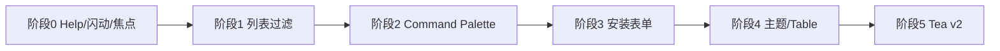

# skill-man TUI 现代化改造路线图

基于 [Bubble Tea examples](https://github.com/charmbracelet/bubbletea/tree/main/examples) 与 Charm 生态（Bubbles / Lip Gloss / Glamour）的对照分析，用于跟踪 skill-man 终端 UI 的演进。

**相关文档：** [skill-man-detailed-design.md](./skill-man-detailed-design.md)

---

## 现状概览

skill-man 已具备双栏布局（列表 + Glamour 预览）、Tab（Skills / MCP）、安装流、模态确认、异步扫描等能力，约覆盖官方示例中 **60–70%** 的常见 TUI 模式。

本路线图把剩余工作拆成可独立交付的阶段，每阶段应有可验证的 UX 变化与 `go test ./...` 通过。

---

## 阶段 0：基础体验打磨（已完成）

| 项 | 说明 | 参考示例 | 状态 |
|----|------|----------|------|
| 上下文 Help 栏 | 底部 `bubbles/help`，按 state / Tab / 选中项显示快捷键；`?` 展开完整键位，`F1` 命令参考屏 | `help` | ✅ |
| 操作反馈 | `flashFooter` 绿色闪动（3s）+ `footerContext` 灰色上下文行；错误优先红色 | `list-fancy`（`NewStatusMessage`） | ✅ |
| 面板焦点高亮 | 列表 / 预览边框与标题色；`↑↓` 聚焦列表，`PgUp/PgDn` 聚焦预览 | `focus-blur` | ✅ |

**主要文件：** `help_context.go`、`footer_status.go`、`styles.go`、`view.go`、`keys.go`、`update.go`

**验证：**

```bash
go build ./...
go test ./...
skill-man   # ? 展开键位；安装/绑定见绿色闪动；↑↓ 与 PgUp/PgDn 看边框变化
```

---

## 阶段 1：列表内联过滤与状态栏（已完成）

| 项 | 说明 | 参考示例 | 状态 |
|----|------|----------|------|
| 内联过滤 | `Ctrl+F` / `/` 进入 `bubbles/list` fuzzy filter；过滤中键盘交给 list | `list-default`、`list-fancy` | ✅ |
| 列表状态栏 | `SetShowStatusBar(true)` 显示可见项数量 / 空状态 | `list-fancy` | ✅ |
| 分页 | `SetShowPagination(true)` 长列表分页 | `paginator` | ✅ |
| 保留面板级搜索 | `showFindPrompt` / `stateSearching` 已弃用；`panel.SearchItems` 仍可用于后续高级搜索 | — | 📋 |

**主要文件：** `list_filter.go`、`model.go`（`configureMainList`）、`update.go`、`keys.go`

**验证：** `Ctrl+F` 或 `/` 进入过滤；`Esc` 清除过滤或回 home；列表底部显示 item 计数。

---

## 阶段 2：发现性与导航

| 项 | 说明 | 参考示例 | 状态 |
|----|------|----------|------|
| Command Palette | `Ctrl+P` 模糊搜索命令（安装、绑定、切换 Tab、inspect、/registry 命令） | 生态惯例 | ✅ |
| 鼠标与焦点 | 点击列表 / 预览切换 `focusedPane`（需 `tea.WithMouseCellMotion` + hit test） | `mouse`、`clickable` | ✅ |
| 预览可点击链接 | OSC 8 hyperlinks 打开 repo / 文档 | `clickable` | ✅ |
| 全屏 Help / Pager | 长文档用 `pager` 覆盖层，不占主列表 | `pager`、`glamour` | ✅ |

**Command Palette 文件：** `command_palette.go` — `sahilm/fuzzy` 匹配；`Enter` 执行；`Esc` 关闭并恢复先前 state。

**鼠标焦点 文件：** `mouse.go` — `paneFromMouse` 按侧栏/堆叠布局 hit test；左键切换 `focusedPane`；预览区滚轮交给 `viewport`。

**超链接 文件：** `internal/render/hyperlink.go` — `ApplyHyperlinks` 为 Markdown 链接文本与裸 URL 注入 OSC 8；`Markdown()` 自动启用。

**Help 覆盖层 文件：** `help_overlay.go` — `F1` 全屏 `viewport` pager；`Esc` / 再按 `F1` 关闭；主列表保持 skills/MCP 不变。

**验证：** `Ctrl+P` → 输入 `reload` / `install` / `bind` → `Enter`；`Esc` 取消。鼠标点击左右面板看边框高亮；预览区滚轮滚动内容。`F1` 打开命令参考覆盖层；预览中 Ctrl+点击（或终端支持的点击）打开链接。

---

## 阶段 3：表单与安装 UX

**安装进度 / 防误退：** `install_flow.go` — `installing` 时显示 progress 条；`quitPending` + 连按 Esc 取消；`Provider.Install(ctx, …)` + `CommandContext`。

**分步向导 / 补全：** `install_confirm.go`、`install_autocomplete.go` — 面包屑四步；确认页汇总；搜索建议含历史与 registry 结果名。

| 项 | 说明 | 参考示例 | 优先级 |
|----|------|----------|--------|
| 分步安装向导 | Search → Pick → Paths → Confirm 四步 + 路径校验；搜索 Tab/↑↓ 补全 | `isbn-form` | ✅ |
| 真实安装进度 | 安装时 `bubbles/progress` 动画条（skills CLI 无字节级进度，上限约 90%） | `progress-download` | ✅ |
| 安装防误退 | 安装中 Esc/Ctrl+C 二次确认；`exec.CommandContext` 可取消 | `prevent-quit` | ✅ |
| Autocomplete | 安装搜索、registry 名补全（`textinput` suggestions） | `autocomplete` | ✅ |

---

## 阶段 4：视觉与终端能力

**主题 / 能力：** `theme.go`、`styles_light.go`、`render/markdown.go` — 启动时 `lipgloss.HasDarkBackground()` + `colorprofile.Detect`；切换后刷新预览。

| 项 | 说明 | 参考示例 | 优先级 |
|----|------|----------|--------|
| 自适应主题 | 深/浅色终端自动切换 Lipgloss + Glamour 样式 | `list-fancy`（`HasDarkBackground`） | ✅ |
| 终端能力检测 | 真彩色等级（`colorprofile.Detect` → `lipgloss.SetColorProfile`） | `colorprofile` | ✅ |
| Table 视图 | Skills/MCP 列视图（名称、agent、路径、状态） | `table` | 低 |
| File Picker | `add` / 路径选择 | `file-picker` | 低 |

---

## 阶段 5：架构（可选，大改动）

| 项 | 说明 | 风险 |
|----|------|------|
| Bubble Tea v2 升级 | `KeyPressMsg`、`tea.View`、`charm.land/*` 模块路径 | 全量 API 迁移，建议独立分支 |
| 可组合子 Model | 安装流 / 绑定流拆为独立 `tea.Model` | `composable-views`、`views` |
| Alt-screen 切换 | 安装日志保留在 scrollback | `altscreen-toggle`、`package-manager` |

---

## 明确不做（除非产品要求）

| 示例 | 原因 |
|------|------|
| `doom-fire`、`eyes`、`canvas` | 炫技，与工具型 TUI 不符 |
| `chat`、`textarea` 多编辑器 | 非核心场景 |
| `tui-daemon-combo`、`pipe` | CLI 架构范畴，非 UI |
| `cellbuffer` 自绘 | 复杂度高，维护成本大 |

---

## Bubble Tea 示例索引（按场景）

| 场景 | 目录 | skill-man 用途 |
|------|------|----------------|
| 列表 | `list-default`、`list-simple`、`list-fancy` | 主列表、过滤、状态消息 |
| 布局 | `tabs`、`composable-views` | Tab、多视图 |
| 输入 | `textinput`、`textarea`、`isbn-form` | Prompt、安装表单 |
| 反馈 | `progress-animated`、`progress-download`、`spinner` | 安装 / 扫描 |
| 帮助 | `help` | 底部快捷键 |
| 预览 | `glamour`、`pager` | SKILL.md / MCP 预览 |
| 交互 | `mouse`、`focus-blur`、`prevent-quit` | 鼠标、焦点、退出确认 |
| 异步 | `http`、`realtime`、`send-msg` | 扫描、安装、预览加载 |

完整列表见：[examples/README.md](https://github.com/charmbracelet/bubbletea/blob/main/examples/README.md)

---

## 推荐实施顺序（简图）



| 顺序 | 工作量 | 用户感知 |
|------|--------|----------|
| 阶段 0 | 小 | 高 |
| 阶段 1 | 中 | 高 |
| 阶段 2 | 中 | 高（power user） |
| 阶段 3–4 | 大 | 中 |
| 阶段 5 | 很大 | 长期维护 |

---

## 变更日志

| 日期 | 内容 |
|------|------|
| 2026-05-19 | 初版：阶段 0 完成项 + 阶段 1–5 规划 |
| 2026-05-19 | 阶段 1：列表内联过滤、状态栏、分页；路线图迁入 `docs/ui-modernization-roadmap.md` |
| 2026-05-19 | 阶段 2：Command Palette（`Ctrl+P`） |
| 2026-05-19 | 阶段 2：鼠标点击切换列表/预览焦点，预览区滚轮滚动 |
| 2026-05-19 | 阶段 2：预览 OSC 8 可点击链接；F1 全屏 Help pager 覆盖层 |
| 2026-05-19 | 阶段 3：安装 progress 条 + 二次确认取消；Install 支持 context 取消 |
| 2026-05-19 | 阶段 3：安装四步向导 + 确认页；搜索 autocomplete（Tab/↑↓） |
| 2026-05-19 | 阶段 4：自适应深/浅主题；colorprofile 终端色彩能力 |

---

## 维护说明

- 完成某项后：将表中状态改为 ✅，并在 **变更日志** 追加一行。
- 若实现与设计分叉（例如保留 `Ctrl+F` 弹窗 + `/` 内联过滤并存），在本节或阶段 1 下补充 **决策记录** 一行即可，无需单独 ADR。
